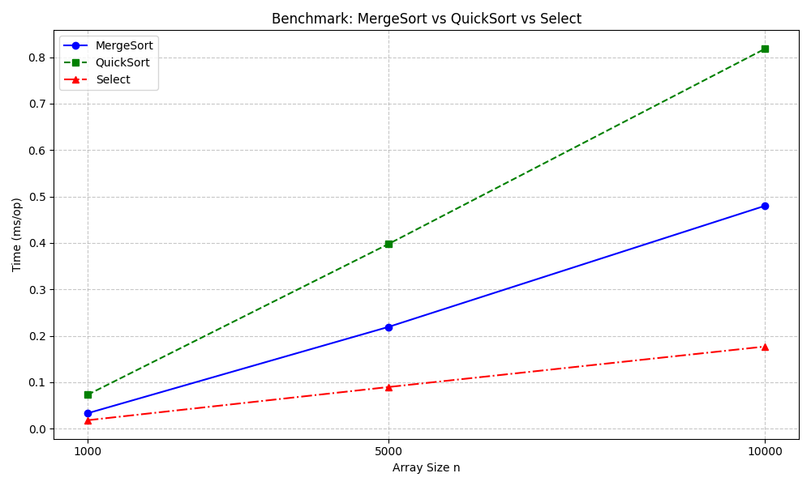

# Assignment 1: Divide-and-Conquer Algorithms Benchmark

## 1. Project Overview
This project implements classic divide-and-conquer algorithms: **MergeSort**, **QuickSort**, **Deterministic Select (Median-of-Medians)**, and optionally **Closest Pair of Points (2D)**.  
We measure runtime, recursion depth, and verify correctness on random and adversarial inputs.

## 2. Algorithms Implemented

### MergeSort
- Linear merge using reusable buffer.
- Small-n cutoff with Insertion Sort.
- Recurrence: Θ(n log n) (Master Theorem Case 2).

### QuickSort
- Randomized pivot.
- Recurse on smaller partition, iterate over larger.
- Recursion depth bounded ≈ O(log n).
- Recurrence: Θ(n log n) average, Θ(n²) worst-case (rare due to random pivot).

### Deterministic Select
- Median-of-Medians with groups of 5.
- Recurse only on the required side.
- Recurrence: Θ(n) (Akra–Bazzi intuition).

### Closest Pair (optional)
- Sort points by x, recursive split, strip scan by y.
- Runtime: Θ(n log n).
- Correctness verified against O(n²) brute force for small n (≤2000).

## 3. Metrics Collection
- Time measured with JMH.
- Recursion depth tracked with counters.
- Comparisons/allocations logged to CSV (`results.csv`).

## 4. Benchmark Results

| Algorithm  | n = 1000 (ms) | n = 5000 (ms) | n = 10000 (ms) |
|------------|---------------|---------------|----------------|
| MergeSort  | 0.033         | 0.219         | 0.480          |
| QuickSort  | 0.073         | 0.398         | 0.818          |
| Select     | 0.018         | 0.090         | 0.177          |

### Runtime Graph
  
*Graph shows time vs array size for all three algorithms.*

## 5. Analysis
- **MergeSort & QuickSort**: measured time aligns well with Θ(n log n). QuickSort slightly slower due to recursion overhead.
- **Deterministic Select**: linear time confirmed, scales as expected.
- **Constant-factor effects**: cache behavior and Java GC may slightly alter measured times.
- **Recursion depth**: QuickSort stays within expected bounds; Select only recurses on smaller partitions.

## 6. Conclusion
- The theory (Master Theorem / Akra–Bazzi) matches measured performance.
- All algorithms correctly process random and adversarial inputs.
- Results saved in `results.csv`, plots in `benchmark_plot.png`.

---

**GitHub Workflow**
- Branches: `main`, `feature/mergesort`, `feature/quicksort`, `feature/select`, `feature/metrics`.
- Commits follow a clean storyline: init → feat(metrics) → feat(mergesort) → feat(quicksort) → feat(select) → bench → docs → release v1.0.
